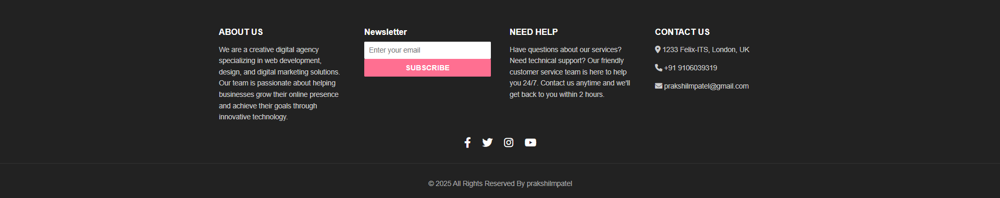

# Footer Example

This project demonstrates a modern, responsive website footer with real content and Font Awesome social media icons.

## Preview

## Features
- Clean, professional footer design
- Realistic company info and contact details
- Newsletter subscription form
- Font Awesome icons for Facebook, Twitter, Instagram, and YouTube
- Responsive layout for all devices

## Usage
1. Open `index.html` in your browser or use a local server (such as Live Server or Python's `http.server`).
2. The footer will appear at the bottom of the page, styled as shown in the preview above.

## Customization
- Edit `index.html` to change the content or links.
- Edit `style.css` to adjust the appearance.

## Requirements
- [Font Awesome CDN](https://cdnjs.cloudflare.com/ajax/libs/font-awesome/6.0.0/css/all.min.css) is included in the HTML for social icons.

---
© 2025 FelixITS. All Rights Reserved.
